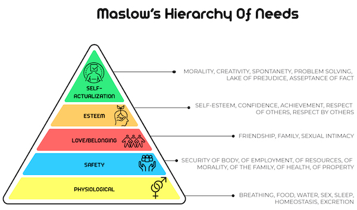
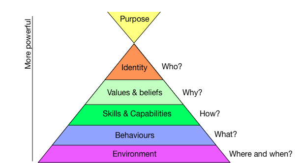
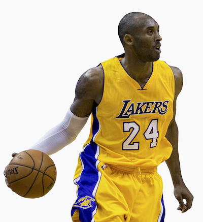
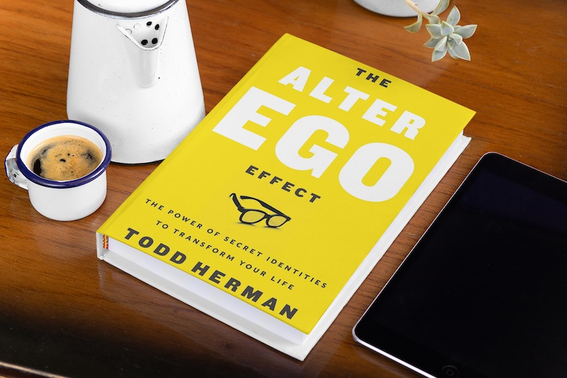

## Starting with Why is Bulls**t. Start with Identity!

I am NOT a Simon Sinek fan!

Yes, he has an army of followers. At the time of writing his YouTube channel has 1.9m followers. His Instagram has 2.8m followers. And his following on LinkedIn dwarfs both of those with a whopping 7.8m followers.

Yes, he's written 5 books. 2 of those books are New York Times best sellers. One of those books has sold over 1 million copies.

So do I have some sort of dislike for this guy out of jealousy? 

No, I have a hatred for Simon Sinek because he is full of sh*t! And no matter how popular someone is, if they are influential enough to lead individuals into a false set of beliefs, I will hate them with a passion! Just think about what Hitler did when he led the German people against the Jews and you will appreciate my sentiment. 

Ok, Simon Sinek is no Hitler. His book 'Start with Why' doesn't have an evil purpose. Also, his intention to motivate people using a known part of human psychology is actually commendable. But it isn't the most powerful part of human psychology that people can tap into to lead and inspire others.

In this article, I'll give you something more powerful for influence and motivation than Starting With Why. I'll also show you how you can use it for yourself to get the results that you want in life, whatever it is that you are trying to achieve. This is a technique I use with my coaching clients. It's a really powerful way to provoke a mindset change that aligns people with where they want to be.

Understanding human behaviour
-----------------------------

 To give you some background context on why this is such a powerful strategy for evoking behavioural change that leads to dramatic results, let's start with a high-level overview of human behaviour.

Have you ever come across Maslow's hierarchy of needs? I cover how it's used in sales psychology in my book Branding For Profit. You can find Branding For Profit on Amazon here or the book along with the video course bundle on the Branding For Profit book website. We examine Maslow's hierarchy of needs here to show how different psychological needs are more compelling than others. Here is the diagram that Abraham Harold Maslow (a renowned American psychologist) created in 1943.
   

   
At the base of the pyramid are the most influential psychological needs. You can see them listed as the basic human needs of breathing, food water, shelter, sleep etc. As you work your way up the pyramid, an individual is less driven to want to fulfil those needs. In other words, the needs at the top of the pyramid are not as powerful in provoking human behaviour to achieve them. The motivation at the base of the pyramid is so strong in fact that human beings will harm or even kill to ensure that need is satisfied. Ever seen people fight over food before? It happens a lot in third-world countries. What is happening here is the primal part of our brain demands that we act for our survival. Stealing, lying, cheating or hurting others holds no value to the reptilian piece of our brain that has a single focus of keeping us alive.

We have now seen how psychological needs can be organised on a pyramid to depict levels of influence on human behaviour. This diagram is the most well-known guide for analysing psychological behaviour that exists today.

Let us turn our attention to another lesser-known pyramid. Just like Maslow's hierarchy of needs, this pyramid acts as a guide for us to understand human behaviour. And just like the hierarchy of needs, psychological motivations are organised into levels of potency. Here is the pyramid depicted in the diagram:

This pyramid is called The Neurological Levels Model.

It's a framework used by coaches worldwide to create the necessary change in their client's behaviour to get them high-performance results. It works by identifying the levels where change needs to happen for their client and then creating strategies to evoke that change.

So is it similar to Maslow's Hierarchy where the bottom of the pyramid is the most powerful level for driving human behaviour? Actually, with the Neurological Levels Model, it's the opposite. The most powerful level that affects human behaviour is at the top.

As can be seen in the diagram, this particular pyramid consists of six levels. Starting from the bottom and going up the levels are Environment, Behavior, Capability, Beliefs and Values, Identity, and Purpose also referred to as Spirituality. If an individual wants to change their behaviour, they can work at a particular level depending on what type of change they want. I'll resist covering the full meaning of each level as that will take too long. But to prove how dramatic the difference in potency is between them, let's use a couple of examples.

Examples of the Neurological Levels of Change
---------------------------------------------

An example from the lowest and least powerful level is a change in someone's environment. Have you ever noticed that you are more productive, creative or motivated depending on where you try to work, exercise or complete some other daily task? You probably find you are more motivated to exercise in a gym than you are using workout equipment in your home? Or you may find you work better in a quiet office than in your kitchen? That's an example of how a change in environment can lead to a change in your behaviour. It's a temporary shift in productivity or motivation as you move around from place to place. It will only last as long as your environment lasts and it won't cause any sort of drastic behaviour change that is different to what is normal.

Now let's go to the top of the pyramid. Purpose or Spirituality is a belief that you are called to do something much higher than yourself. Have you ever heard of a born-again Christian? It's a typical story that I'm sure you have heard before.  Let's give our character a name to set the scene. Let's call him John. John commits atrocious crimes such as armed robbery, and killing. He leads a life of violence and abuse. He's done so since being a teenager. He started these crimes when he joined a gang called the Bloods. He then took on the gang's identity of caring only about their own wants and desires and stopping at nothing to get them. He has vowed to be a gang member for life. To show his dedication to the gang, he even has the Blood's signature tattoo on his face.

John is finally caught by law enforcement and locked up. Once behind bars, with nothing better to do, he starts reading the Bible. He also starts attending the prison church and associating with other church members. Then what happens? One night in a dream God speaks to John directly. God tells him that he has a higher purpose in life. Instead of gangbanging, God asks him to live his life loving others and spreading God's word. On waking, John knows exactly what he must do. His new purpose prevents him from taking on the gang life that he used to identify with. He can no longer steal, lie, cheat or kill. He is completely reborn and going forward he will only do good as defined by the loving God who forgave him of his atrocities. He is a born-again Christian.

Can you see how dramatic the change in someone is based on a shift in their purpose? It is a much more powerful transformation than the lower-level change in the environment.

So how can we use these levels to get the desired human behaviour that we want for ourselves?
---------------------------------------------------------------------------------------------

Shifts in Purpose or Spirituality for individuals are rare. What we can do, however, is tap into some of the lower levels such as Identity or Beliefs and Values to drive human behaviour. You can see from the Neurological Levels Model that Identity maps to the Who we show up as, whereas Beliefs and Values maps to the Why we show up.

Remember that guy Simon Sinek? If you read into his story, you will note that there was a period in his life when he fell into depression and lost his zeal for the company he started. Apparently, so the story goes, after a magic meeting with someone, he discovered the best and most effective strategy for marketing while understanding the "How and Why" people succeed in business. He then began to write his first book, Start with Why: How Great Leaders Inspire Everyone to Take Action. When released the book became a huge success.

What Simon has done with his book is tap into the Why level in our pyramid. He has given people a reason to show up based on Beliefs and Values. Leaders determine what their Why is for themselves and then continue to inspire that belief in others. The belief in turn motivates and influences their behaviour along with anyone that shares in that belief.

What is interesting about the story is that the book became Simon's Why. He ultimately used the same technique for himself to lift himself out of depression and motivate himself to continue running his company.

So one way you can get a particular result for yourself is to give yourself a Why. Create a strong reason for doing whatever it is that you want to be doing based on some underlying belief. By the way, did you know that Simon Sinek studied Cultural Anthropology for his Bachelor's degree at University? And did you know that the Neurogical Levels Model has it's origins in Anthropology based on the work of Gregory Bateson?

Whether knowingly or unknowingly, Simon Sinek tapped into people's Beliefs and Values and used their Why to motivate them to drive change. But as depicted in the diagram, Identity sits above Beliefs and Values and is therefore a more influential force to tap into.

Using Identity i.e the Who inside you to achieve far greater results than the Why
---------------------------------------------------------------------------------------------

Now let me show you how you can use identity for yourself to achieve greater results in any area of your life. It works by creating a secret identity to transform yourself in whichever area of life you believe you need better performance.

This particular technique has been used by the peak performance coach Todd Herman for over 22 years while working with elite athletes, international superstar entertainers, and entrepreneurial leaders. Due to the high-profile nature of his clients, when talking about his work he keeps their real identities a secret. However, you know many of them. And for sure you are aware of the accolades they have achieved. What might go unnoticed, however, is how they use this powerful psychological trait of identity to achieve such tremendous results.

Let's expose one female artist who has dominated the music industry for many years. She started off her career in a world-famous R&B group. In a 5 year period, the group were nominated for and won several music awards. The awards include Artist of the Year, R&B/Hip-Hop Group of the Year and Best R&B Song. Winning these awards propelled her into the limelight and she rose to fame.

After achieving this fame, it was time to start her solo career. A solo career where she would continue to rack up numerous music awards and turn herself into a music icon. In 2008, she released an album with the title, I am ... Sasha Fierce. This album went on to sell over 10 million copies worldwide, making it one of the best-selling albums of the 21st century.

But why did this artist release an album titled I am ...Sasha Fierce. Who is Sasha Fierce?

In several interviews, Beyonce admits she used to be a very shy, introverted, clumsy individual. The real-life personality she started with didn't have the characteristics she would need to achieve what she wanted to achieve. How could a shy, person who was anxious about being in public groups perform on stage in front of millions of people? She knew she had to transform. She had to take on a different personality that would possess the traits of a peak-performer. She needed an identity that would be fearless when on stage and would wow audiences with her sexy, suave movements. And so ... Sasha Fierce was born.

Sasha Fierce is the alter ego of the album's producer Beyonce Knowles. It's an identity that Beyonce gives herself to perform to the highest level despite being a completely different person in real life. In total Beyonce Knowles has racked up 1312 nominations for awards and won a whopping 612 of them. She is the most-awarded and most nominated artist in Grammy history. None of this would have been possible if she didn't take on an alter ego. She gave herself an identity that embodied characteristics of a sexy, flamboyant, highly confident performer. A performer that achieved the success we all recognise her for.

Are there other examples of identity change having a huge impact in people's lives?

Many other well known athletes and superstars are using an alter ego to achieve such great results. Todd Herman has coached quite a few of them and wrote about it in his book titled 'The Alter Ego Effect'. Have you ever heard of the 'Black Mamba'? That was world-famous basketball superstar Kobe Bryant's alter ego.

The level of transformation received from a change in identity can be instant and quite profound. If you have ever seen some of the best hypnotists at work, it's the very same psychological mind shift they impose on their subjects. "Act like a chicken," they say to their subjects when they are under hypnosis. And low and behold, to the audience's delight, with a snap of the fingers the person transforms into a chicken on stage.

Now acting like a chicken might be good for a few laughs and giggles. But what about using an identity to show up as someone you need to become? Are there any situations you can think of where taking on the identity of a great business leader, an awesome husband or wife, or a captivating public speaker would help you achieve something you are after?

Does this powerful identity shift technique belong to only top athletes and high-performance entertainers because they are rich and famous? Clearly not. However, most of regular society hasn't woken up to the fact that high-performance coaching is available to all of us. I created business coaching for this very purpose. When I needed coaching for my entrepreneurial pursuits, there simply wasn't an organisation or any individuals there to provide it. I now offer it as part of Business Launch Academy because I know how critical an impenetrable mindset is to us achieving whatever it is we want to achieve.

Conclusion
----------

If you want to try this technique for yourself even without going through coaching, I would highly recommend starting with Todd Herman's book which you can get here: the 'Alter Ego Effect.'

In conclusion, 'Starting With Why" is a great psychological anchor to hook onto when you want to motivate yourself or others to achieve something. But 'Starting With Identity' is an even more powerful technique when you want drastic and instantaneous results.