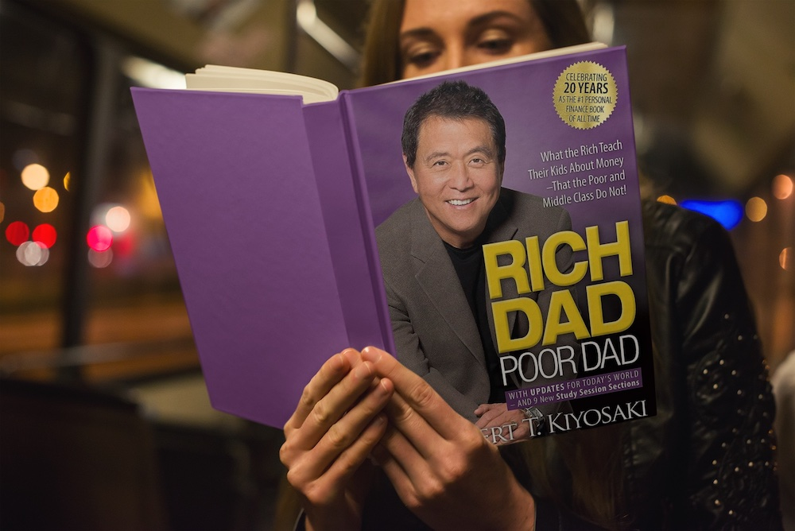
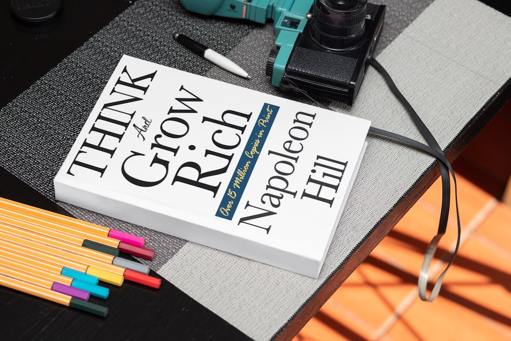
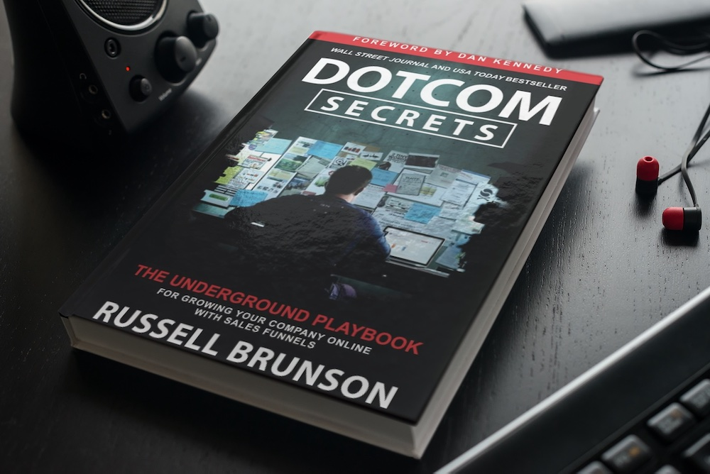
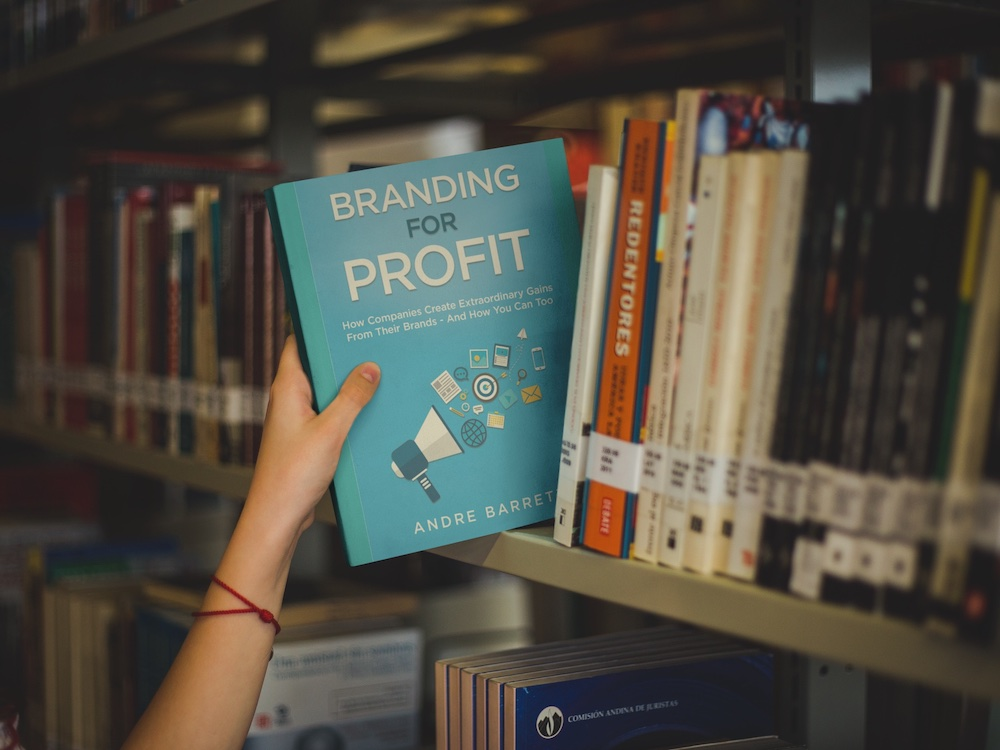

I have only one regret in life.

It's a hard-learned lesson that I try to ensure no other entrepreneur makes. That is the reason for this article.

Without a shadow of a doubt, the most instrumental life-changing activity that I have taken part in is reading books. It was a while after becoming a proactive reader that I discovered these stats. On looking back over my journey and seeing the success I have achieved to date, it all makes sense. If you are someone looking for any kind of business success, these statistics will give you hope:

- 86% of the wealthy loved reading vs. 26% for the poor

- 63% of the wealthy listened to audiobooks during their commute to work vs. 5% for the poor

- 85% of the wealthy read two or more self-improvement books every month vs. 15% for the poor.

When looking at these kinds of statistics taken from Thomas Corley (author of Rich Habits, Poor Habits) you can only summarise one thing: Wealth is highly correlated to reading. In other words, reading more can dramatically increase the size of your bank account!

My only regret in life is that I didn't start reading business and self-help books much sooner. There are some fantastic books I have read that I would consider to be life-changing. Unfortunately, most books I read would not come close to this sort of praise. So to give you a shortcut, I have compiled the top 5 list of books that I would consider as a must-read for every entrepreneur. These books are particularly great if you are starting your entrepreneurial journey or you still haven't yet embarked.

I have selected these particular books because of:

a) How easy they are to read. A complicated book puts people off reading. Especially if you don't have much time. No one needs that

b) How influential the message is to make you take action. If a book can influence you to act, the return on time invested for the reader is huge

c) How powerful the lessons are for impacting your business and in turn your life. The most important lessons have the biggest outcome

What are the top 5 books for entrepreneurs?
-------------------------------------------

With no time to waste, we are going to dive in right at number 1.

### 1\. Rich Dad Poor Dad - Robert T. Kiyosaki

#### - Rich people don't work for money

This book deserves the title as the gateway drug for entrepreneurs. If there is any form of entrepreneurial spark within you, this book turns it into a flame. I would even go as far as saying that it hands you the keys to the vehicle of wealth generation. That's why it makes it in as number 1.

Let me show you what I mean by giving you the outline of the book:

It begins in the 1950's. Robert and his friend Mike were curious boys with big ambitions: When they grew up, they wanted to become rich and make a lot of money. But just *how* they were going to accomplish that they didn't actually know. They asked their dads how they could start becoming rich.

One dad, Robert's own well-educated but "poor dad," had the mindset with the belief that to be successful you need to: "Go to school, study hard, and find a good job."

Mike's dad, on the other hand, had a different mindset. Unlike Robert's dad, he had no doctorate, no degree, and didn't ever have a job. He had left school with very little qualifications.

Out of both dads, Mike's dad was the wealthiest. He could even be considered as rich. The most profound thing about Mike's dad's situation was that as time went on, his wealth continued to grow but with less effort and less time spent on that goal.

Most people have a poor dad mindset. They carry the misguided belief that society drills into us. A good job is what leads to wealth, we're told. We therefore study hard as kids and work even harder as adults. The result? Most avoid poverty, but their wealth is limited to afford an average life for themselves and their families.

I would suggest reading this book multiple times.

**Why read Rich Dad Poor Dad multiple times?**

If you started from humble beginnings like I did, you were most likely raised with the poor dad mindset. When the rich dad's message is first delivered, it doesn't soak in as deeply as it should. The learnings must go through multiple layers of misinformed beliefs and values that we have developed over the years. This book as well as the path that it puts you on will eventually wipe out the beliefs that don't serve your purpose. As far as transformation goes, it's the most powerful book out there.

### 2\. Think And Grow Rich - Napoleon Hill

#### - We can only accomplish our aims in life if we are driven by a burning desire.

Out of all the books I am recommending, I found this one the hardest to read. After learning about human psychology and developing an awareness of my mindset issues, looking back I can understand why.

When it comes to business, people often believe the business itself is the biggest challenge. They consider external factors the main cause of why they can't grow or achieve their goals. They blame their surroundings. They blame the economy. They blame their clients and their employees. They blame everything and everyone else but themselves.

It was Rumi who said it best:

> Yesterday I was clever, so I wanted to change the world. Today I am wise, so I am changing myself.

Your biggest challenge in business will be yourself. Your internal thoughts will hinder you. Your mindset will ultimately hold you back. This book aims to overcome that obstacle.

If you grew up poor like me, you undoubtedly were also nurtured with a poverty mindset. You develop limiting beliefs that stop you from thinking thoughts that could move you forward. Your current way of thinking acts like a rope around your neck tying you to a location you are desperate to leave.

What I didn't fully appreciate at the time of first reading, was how powerful these limiting beliefs are. The book gives you instructions on how to start thinking like a rich person. Rather than follow the instructions, however, I resisted. I found myself with thoughts such as: "that is stupid" and "it's never going to work". My internal mindset proved to be a barrier that wasn't ready to be broken.

If like me, you find first find this book hard to read, this is a sign that you have a lot to overcome. You can overcome your mindset obstacles by continuous reading. But if you want to shortcut the process, you will need to find a different way to do it, like coaching for example.

### 3\. DotCom Secrets - Russell Brunson

#### - The Underground playbook for growing your company online with sales funnels

I was introduced to Russell Brunson through a late night video ad. I still remember it like it was yesterday because it was one of those eye-opening moments that could be considered as a turning point in my life. Internet marketers had already been using his strategies for years at this point. These very strategies not only made them millions online but turned them into well-known experts in their field. Although he probably didn't create it, he is highly regarded as the king of sales funnels due to making it popular with his platform clickfunnels.

In true sales funnel style, the DotCom Secrets book is part of his sales funnel strategy. It's a low-priced item to introduce you to Russell as well as the concepts of an online sales funnel. The book is written to convince you that using his platform clickfunnels is the best way to make tons of money online. Once you are convinced, then the next step would be to pay more money and sign up to use his platform. Like any good sales funnel, however, there are upsells along the way. Once you are using the platform, you will probably need other courses on marketing and effective selling. The sales funnel is designed to sell you exactly what you need at the time that you need it.

**Why is DotCom Secrets in the top 5 book list?**

Marketing is the most important key function of a business. Without awareness of a product or service that a business sells, that business has zero chance of making any money. Today, and for the foreseeable future, the internet is by far the best way to reach an audience. It's a fact that online marketing has been the vehicle to create the most number of millionaires since the start of the human race. This book is the guide to joining one of those privileged members of the online millionaire's club. Not only does it give a high level of understanding of sales funnels and marketing in general, it's also packed with practical instructions to implement this for yourself. Most other online marketing books pale in comparison.

DotCom Secrets gives you invaluable insights into digital marketing strategies. Russell presents readers with a roadmap for understanding your customers, communicating effectively, and guiding these customers smoothly up the Value Ladder. He covers in depth the exact steps on how to implement the 'sales funnel', a system that attracts customers at the wide top end with free or low-cost offers and guides them through successive stages of commitment, culminating in high-ticket purchases at the narrow bottom end. If you are in business or thinking of starting, this is the missing guide on how to market that business effectively.

### 4\. The Undercover Economist - Tim Harford

#### - The economy has a huge impact on the simple choices you make every day.

What is the economy? If I asked this question to a few random individuals on the street I would probably get several different answers. The lack of agreement would be a clear indication that very few people understand the economy in great depth. Yet, the economy is so powerful that any small change has a dramatic impact on our lives. Why then is something so important so misunderstood?

Sipping your morning cappuccino, do you ever stop to think how that cappuccino got there? Probably not. Yet, perhaps you should, as it reveals crucial insights about our economy, and thus our lives. Even something as simple as a cappuccino is the result of the economy's ability to bring many professions together.

**Imagine trying to make that cappuccino all by yourself.**

Where would you even begin? You'd need to first grow the coffee beans, harvest, dry and blend them. You'd also need to raise a cow, gather its milk, and then fashion your coffee mug out of clay. Finally, in a spark of engineering genius, you'd have to build an espresso machine.

Could you tackle all this by yourself? Not likely. You rely on an entire economic system, especially the division of labour across the world, to produce your favorite morning beverage. Maybe you decide to buy your morning coffee, instead. Even the price that you pay is tied to an entire economic system.

The good news is you don't need a degree in economics to have a full understanding of how to use it for yourself. This is why this book makes the top 5 book list. It gives you a grounding in economic fundamentals. Is reading this book going to give you enough to have an economic debate? No. Is this book going to give you an awareness to make better business decisions? Yes. And what is super important is that you make good decisions from the start. If you set up a business where the economy is moving against you, then chances are you are going to fail after wasting valuable time and resources. This book will provide you with insights that allow you to think like an economist, and thus better understand the world around you.

### 5\. The Richest Man In Babylon - George S. Clason

#### - The secret to building wealth is to save and invest wisely.

Have you ever wondered why some people are better at acquiring wealth than others? Is it because they are thrifty and stuff every penny they save into their mattress, while others squander what they earn on all kinds of trinkets?

I started asking myself these questions during the economic downturn known as the Great Financial Crisis. At the time, I had no idea how money worked or why some people were able to command more than others. I made it my personal mission, however, to find out. I studied economics, corporate finance, alternative investing, the stock market and even banking. I signed up for course after course and read book after book on the topic. Eventually, I came across this book and it became one of my favorites of all time.

**What conclusion did I draw from my experience?**

Wealth generation all comes down to a few fundamentals. That's why this book makes my top 5. Avoid the courses and all the theoretical nonsense that people try to sell you. Simply understand and put into practice the sound principles that this book gives you. As the book implies, the cornerstone of wealth rests on understanding how to make sound investment decisions. By investing, you are no longer trading your time for money. Instead, your money becomes like your employee, working away to earn you more money in return.

**Why should an entrepreneur learn investment principles?**

What is commonly misunderstood about entrepreneurship is that the very word describes an investor. Just google the meaning of an entrepreneur and here is the definition that comes up:

> An entrepreneur is an individual who creates a new business, bearing most of the risks and enjoying most of the rewards. The process of setting up a business is known as entrepreneurship

-- Google Search Result

Do you notice the key words risk and reward?

Now let's look at the meaning of the word investor:

> a person or organization that puts money into financial schemes, property, etc. with the expectation of achieving a profit
 
-- Google Search Result

If we compare the two definitions, they are fundamentally the same. An entrepreneur commits resources to a business. These resources include money and time. There is an expectation to make a profit from the business which is their reward. Because there is no guarantee an entrepreneur is taking a risk. An entrepreneur is nothing more than an investor using a business as their investment vehicle. Learning investment principles, therefore, makes you a better entrepreneur.

BONUS BOOK RECOMMENDATION
-------------------------

I have added this book as a bonus because it also deserves the accolade as a must-read for entrepreneurs.

### Branding For Profit

#### - How companies create extraordinary gains for their brands and how you can too.

I am, of course, the author of this book. I wrote it for early-stage entrepreneurs to help them avoid the mistakes that I made at the start of my journey. To stop claims of bias, however, rather than write a personal review, I have linked to a third-party review. You can see what others have to say about the book here:

<https://reedsy.com/discovery/book/branding-for-profit-andre-barrett#review>

#### Where can I get the Branding For Profit book?

You can find the book and video course on [the Branding For Profit book website](https://brandingforprofitbook.com)